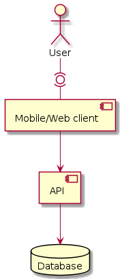

# Martur Food Truck

Este é um projeto de estudo de caso, para o controle de vendas fiado, o famoso caderninho de boteco.

## Senta que lá vem a história

* A Martur criou um novo serviço: MarturFoodTruck. Com duas filiais que podem expandir para mais.
* Os clientes são tudo gente fina, então, a gerência da MarturFoodTruck faz fiado pros clientes e anota tudo num caderninho.
* Nosso problema é facilitar a vida dos caixas, na hora de fazer o acerto dos clientes.
* Então, vamos digitalizar o caderninho de fiado.

## Objetivo

Construir um aplicativo web que possa ser utilizado no celular para que o lojista faça os registros de vendas a crédito.
  
## Requisitos funcionais

1. Cada filial tem dois funcionários que se revezam no caixa
2. Cada filial tem seu próprio caderninho de fiados.
3. O cliente precisa pagar sua dívida sempre na mesma filial.

## Requisitos não funcionais

1. Web APP PWA para possibilitar o uso via navegador e instalação fácil no dispositivo móvel.
2. Desenvolvimento orientado a offline-first, com atualizações de dados assíncronas com o backend.
3. Identificadores de entidades não numéricos, para não correr o risco de problemas com criação de entidades offline.

## Casos de uso

## Classes

## Arquitetura

