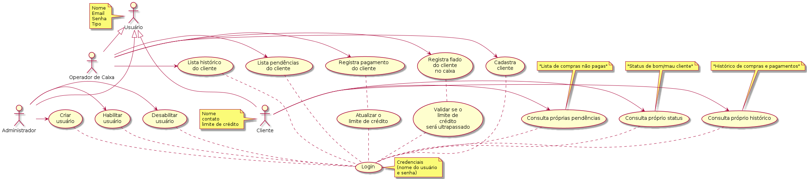

# Martur Food Truck

Este é um projeto de estudo de caso, para o controle de vendas fiado, o famoso caderninho de boteco.

## Senta que lá vem a história

* A Martur criou um novo serviço: MarturFoodTruck. Com duas filiais que podem expandir para mais.
* Os clientes são tudo gente fina, então, a gerência da MarturFoodTruck faz fiado pros clientes e anota tudo num caderninho.
* Nosso problema é facilitar a vida dos caixas, na hora de fazer o acerto dos clientes.
* Então, vamos digitalizar o caderninho de fiado.

  
## Requisitos funcionais

1. Cada filial tem dois funcionários que se revezam no caixa
2. Cada filial tem seu próprio caderninho de fiados.
3. O cliente precisa pagar sua dívida sempre na mesma filial.

## Casos de uso

## Classes

